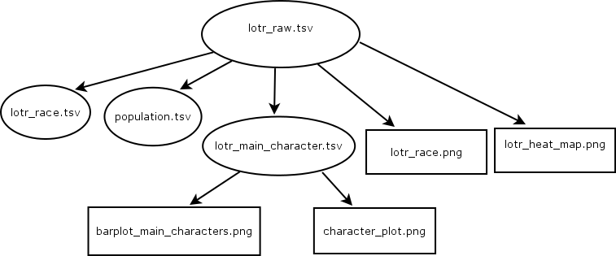

My pipeline flows can be summarized by the graph here:

There are THREE `R Scripts`, FOUR `tsv` files, FOUR `png` plots. The `report.rmd` is the final report that gives tables, plots, statistical analysis and my reflections.

`Makefile` executes the pipeline flow.
