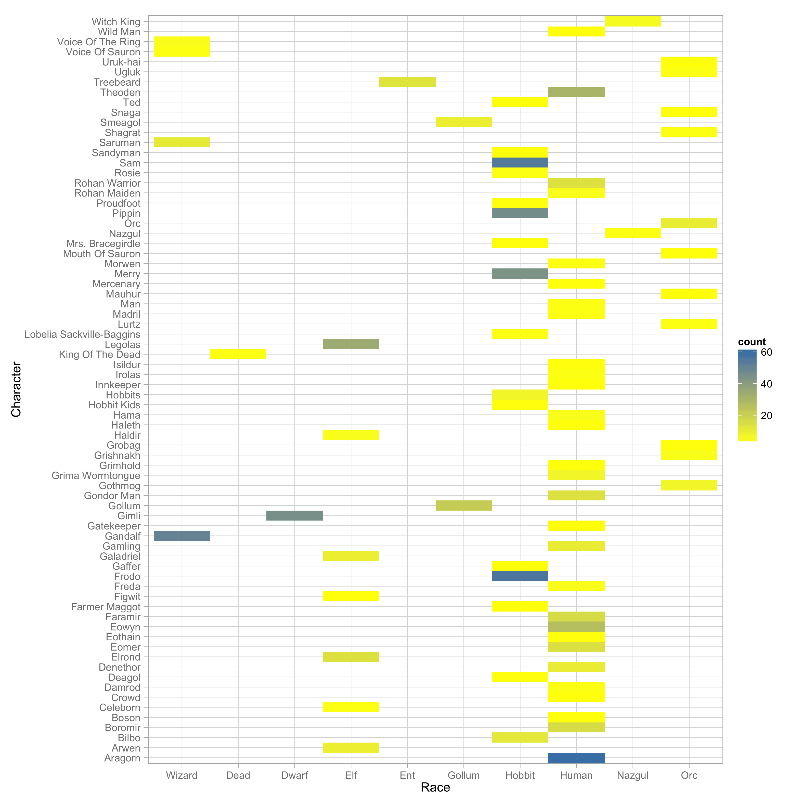
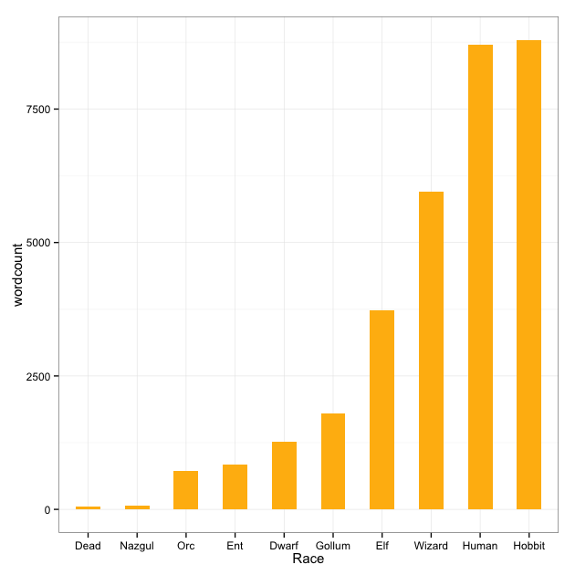
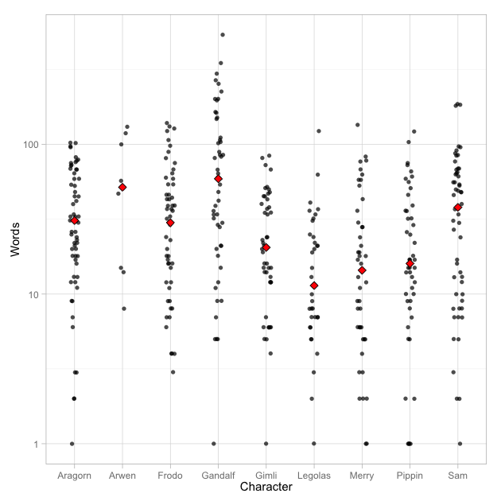
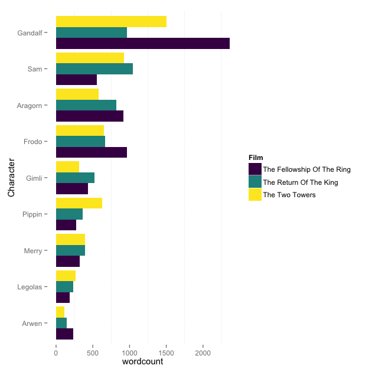

## Big Picture

This assignment is about automating data-analysis pipelines using `Makefile`. My workflow can be described in general as the following:

 + Download data `lotr_raw.tsv` and save it locally
 + Read data and preform data cleaning
 + Write numerical data to CSV files `lotr_main_characters.tsv`, `lotr_race.tsv`, `population.tsv`
 + Data analysis, generate figures and save them to files `character_plot.png`,`barplot_main_characters.png`, `lotr_heat_map.png`,`lotr_race.png`
 + Write reports as a combination of data, statistical results and figures
 + Pipelines are generated in `Makefile` for each step 

##My Work

The data I worked with is the [Lord of the Rings data][1]. It contains information of the number of words spoken by 74 characters from 10 races in the Lord of the Rings trilogy. 


```{r,echo=FALSE}
suppressPackageStartupMessages(library(dplyr))
lotr_dat <- read.delim("lotr_raw.tsv")
lotr <- tbl_df(lotr_dat)
```

```{r}
head(lotr)
```

To see how many characters from each race, I make a summary table. There are a lot of Human and Hobbits. 

```{r}
population <- read.delim("population.tsv")
knitr::kable(population, format = "markdown")
```



The heat map also gives me an idea that how frequent a character appears.


I want to know which race speaks the most. Hobbit speaks the most since the protagonists are Hobbits.

```{r}
lotr_race <- read.delim("lotr_race.tsv")
knitr::kable(lotr_race, format = "markdown")
```



Also, I want to know who speaks the most. I have summarized words counts for the main characters that I am interested in. From the plots, I found Gandalf the wizard speaks the most, followed by Sam, Frodo and Aragorn. 





##Reflection 
This is my first time writing a pipeline using `make`. I was confusing in the beginning and I lost track of dependency relationships as I wrote more csv files and figures. 

The templates are really helpful. I used the same data in the templates, but had different statistical analysis. 

I think `Makefile` is easier than running commands in the `shell`. I would like to explore some of the [additions][2] that can be included in my `Makefile`.

[1]: https://github.com/jennybc/lotr
[2]:https://www.gnu.org/software/make/manual/html_node/Special-Targets.html
